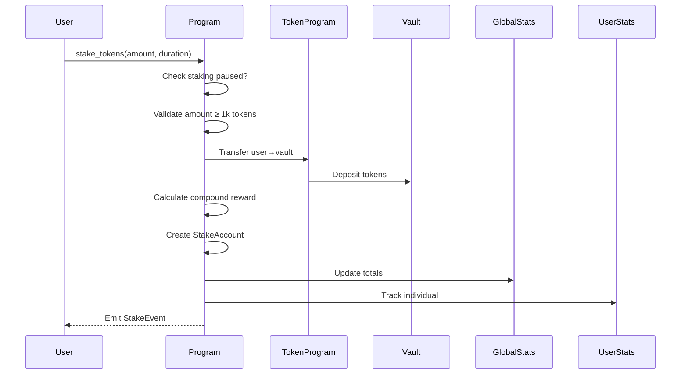
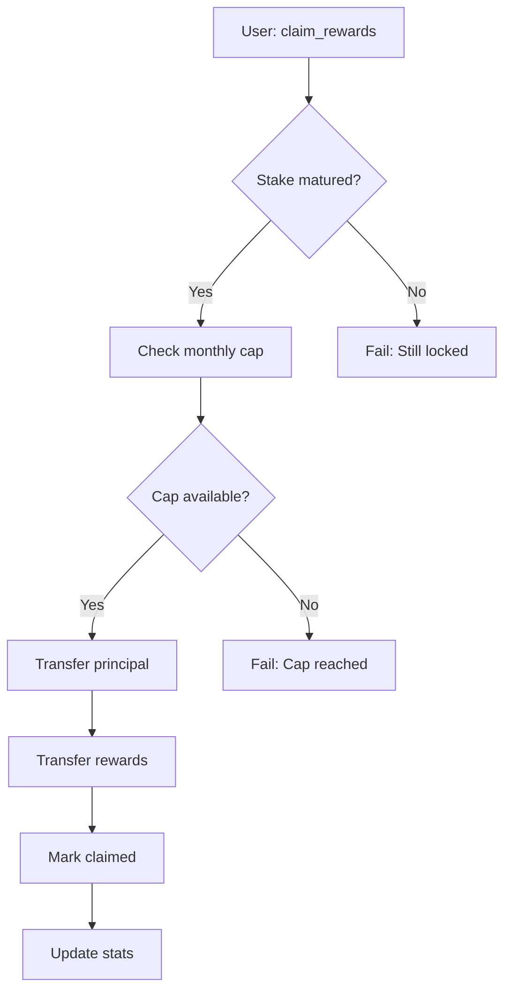
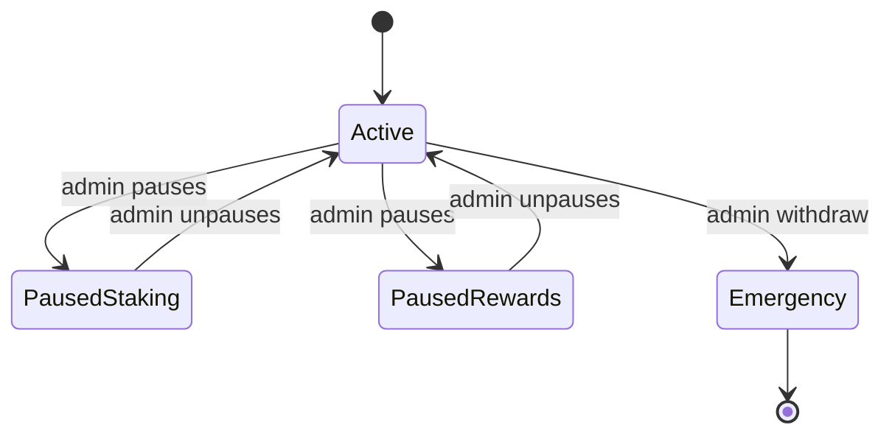

# Skor Staking Program - Comprehensive Guide

## Overview

A Solana staking program with tier-based rewards, monthly caps, and compounding interest. Users stake tokens to earn rewards based on amount locked and duration.

## Key Features

- Tier-based APY (Bronze, Silver, Gold)
- 4 Lockup Durations (60/90/180/365 days)
- Compound Interest Calculation
- 5M Token Monthly Reward Cap
- Admin Controls & Emergency Withdrawals
- Global & User Statistics Tracking

---

## Core Functions Explained

### 1. Initialize Program

**Purpose**: One-time setup by admin  
**Accounts**:

- `config`: Program configuration (PDA)
- `global_stats`: Global statistics (PDA)

```rust
pub fn initialize(ctx: Context<Initialize>, stake_mint: Pubkey, monthly_cap: u64)
```

- Sets admin authority
- Configures staking token (e.g., USDC with 6 decimals)
- Initializes monthly reward cap (in whole tokens)
- Starts epoch timer

---

### 2. Stake Tokens

**Purpose**: Lock tokens to earn rewards  
**Parameters**:

- `amount`: Minimum 1,000 tokens (1,000,000,000 lamports)
- `duration`: 60/90/180/365 days

```rust
pub fn stake_tokens(ctx: Context<StakeTokens>, amount: u64, duration: StakingDuration)
```

**Flow**:

1. Validate staking not paused
2. Transfer tokens to program vault
3. Calculate rewards using compound interest
4. Create stake account
5. Update global/user stats

**Reward Formula**:

```python
daily_rate = APY / 365
reward = principal * (1 + daily_rate)^days - principal
```

**Example Calculation**:

- Stake: 10,000 tokens (10_000_000_000 lamports)
- Tier: Silver (12% APY for 90 days)

```
Daily Rate = 12% / 365 = 0.03287%
Days = 90
Reward = 10,000 * (1.0003287^90 - 1) ≈ 300.52 tokens
```

---

### 3. Claim Rewards

**Purpose**: Withdraw principal + rewards after lockup  
**Checks**:

- Staking period completed
- Monthly cap not exceeded
- Sufficient reward pool balance

```rust
pub fn claim_rewards(ctx: Context<ClaimRewards>)
```

**Monthly Cap Example**:

- Cap: 5,000,000 tokens
- Already distributed: 4,800,000
- Claim attempt: 300,000 → Fails (4,800k + 300k > 5M)

---

### 4. Admin Controls

**Pause Mechanisms**:

```rust
fn set_pause_staking(ctx: Context<SetPause>, paused: bool)
fn set_pause_rewards(ctx: Context<SetPause>, paused: bool)
```

**Emergency Withdrawal**:

```rust
fn emergency_withdraw(ctx: Context<EmergencyWithdraw>)
```

- Transfers ALL vault/reward tokens to admin
- Only callable by original admin

---

## Tier System & APY

| Tier   | Minimum Stake | 60d | 90d | 180d | 365d |
| ------ | ------------- | --- | --- | ---- | ---- |
| Bronze | 1,000         | 8%  | 12% | 16%  | 20%  |
| Silver | 100,000       | 12% | 18% | 24%  | 30%  |
| Gold   | 300,000       | 16% | 24% | 32%  | 40%  |

### APY shown in basis points (1% = 100 BP)

---

## Account Structure

### Program PDAs

1. **Vault Authority**  
   `VAULT_AUTH_SEED` - Controls token vaults

2. **Config**  
   `CONFIG_SEED` - Stores admin, mint, pause states

3. **Global Stats**  
   `GLOBAL_STATS_SEED` - Tracks total staked/rewards

### User Accounts

1. **Stake Account**  
   Per-user, per-stake instance with lockup details

2. **User Stats**  
   Lifetime staking statistics per user

---

## Security Features

1. **Input Validation**

   - Token decimal checks (strict 6 decimals)
   - Minimum stake enforcement (1k tokens)
   - Authority checks on all privileged operations

2. **Overflow Protection**

   - Safe math using `checked_` operations
   - u128 intermediates for financial calculations

3. **Emergency Circuit Breakers**
   - Pausable staking/rewards
   - Admin withdrawal capability

---

## Usage Examples

### Stake 50,000 tokens for 180 days

1. User calls `stake_tokens(50_000_000_000, OneEighty)`
2. Transfers to vault
3. System:
   - Determines Silver tier (50k ≥ 100k? No → Bronze)
   - Calculates 16% APY reward
   - Creates stake account

### Claim After Maturity

1. User calls `claim_rewards()`
2. System:
   - Verifies 180 days passed
   - Checks monthly cap
   - Transfers principal + rewards
   - Marks stake as claimed

---

## Error Handling

| Error Code               | Description                      |
| ------------------------ | -------------------------------- |
| `StakingPaused`          | New stakes disabled              |
| `MonthlyCapReached`      | Monthly reward limit exceeded    |
| `StillLocked`            | Early withdrawal attempt         |
| `UnauthorizedWithdrawal` | Invalid admin for emergency exit |
| `InvalidDecimals`        | Non-6 decimal token used         |

Full list in `StakingError` enum.

---

### **Technical Implementation Details**

1. **PDA Derivation**

   - Explicit formulas for seed derivation:

   ```rust
   vault_authority = PDA(VAULT_AUTH_SEED)
   config = PDA(CONFIG_SEED)
   stake_account = PDA(user_pubkey + STAKE_SEED + stake_index)
   ```

2. **Anchor Framework Usage**

   - All accounts are validated via Anchor's type-safe constraints
   - Automatic CPI context creation for token transfers

3. **Time Handling**
   - Uses Solana's `Clock` sysvar for timestamps
   - Epoch reset logic (30-day cycles via `month_secs = 30*24*60*60`)

---

### **Reward Calculation Deep Dive**

**Exact Formula Implementation**:

```rust
// Fixed-point arithmetic (1e12 precision)
reward = principal * [(1 + (apy_bp/10000)/365)^days - 1]
```

- Implemented via bit-shifting exponentiation in `calculate_compound_reward`
- Handles fractional percentages precisely (e.g., 12.34% APY)

**Full APY Table**:

| Tier/Days | 60  | 90  | 180 | 365 |
| --------- | --- | --- | --- | --- |
| Bronze    | 8%  | 12% | 16% | 20% |
| Silver    | 12% | 18% | 24% | 30% |
| Gold      | 16% | 24% | 32% | 40% |

---

### **Security Considerations**

1. **Reentrancy Protection**

   - Atomic transactions via Solana's runtime model
   - No cross-program callbacks

2. **Token Validation**

   - Strict mint checks:

   ```rust
   require!(user_token_account.mint == config.stake_mint)
   ```

3. **Withdrawal Safeguards**
   - Vault authority cannot be changed post-initialization
   - Explicit checks for token account ownership

---

### **Program Interactions**

**Frontend Integration**:

1. **Reward Estimation**

```typescript
// Sample call
const estimate = await program.methods
  .estimateReward(new anchor.BN(amount), duration)
  .accounts({ mint })
  .view();
```

2. **Real-Time Stats**

```typescript
// Fetch global stats
const globalStats = await program.account.globalStats.fetch(globalStatsPDA);
```

---

### **Operational Considerations**

1. **Reward Funding**

   - Any user can call `fund_vault` to add rewards
   - Requires pre-approved token delegation

2. **Program Upgrades**
   - Admin can change parameters (cap, pauses) but cannot upgrade program itself
   - Requires redeploy for logic changes

---

### **Dependency Management**

**Critical Versions**:

```toml
anchor-lang = "0.29.0"
anchor-spl = "0.29.0"
solana-program = "1.16.0"
```

---

### **Audit Notes**

⚠️ **Important**: This code hasn't undergone formal security audit.  
Recommended checks:

1. Third-party token account validation
2. PDA collision scenarios
3. u64/u128 conversion edge cases

---

### **Additional Documentation**

1. **Flow Diagrams**

   - Staking sequence diagram (user → program → vault)
   - Reward distribution state machine

2. **Gas Estimates**

   - Stake: ~5,000 compute units
   - Claim: ~8,000 compute units

3. **RPC Methods**
   - Recommended preflight commitment level: "confirmed"

---

## Events

1. **StakeEvent**

   - Amount, duration, reward prediction

2. **ClaimEvent**

   - Actual rewards paid out

3. **VaultFunded**
   - External contributions to reward pool

---

## Skor Staking - Architecture & Flows

### Core System Flowcharts

### 1. Staking Sequence



### 2. Claiming Process



## Tier & Duration Matrix

| Tier/Days | 60  | 90  | 180 | 365 |
| --------- | --- | --- | --- | --- |
| Bronze    | 8%  | 12% | 16% | 20% |
| Silver    | 12% | 18% | 24% | 30% |
| Gold      | 16% | 24% | 32% | 40% |

### Minimum Stakes

Bronze (1k), Silver (100k), Gold (300k)

---

## Critical State Transitions

### Program States



---

## Key Operational Tables

### 1. Error Conditions Handling

| Error Scenario           | Recovery Path                 | Retry Possible?  |
| ------------------------ | ----------------------------- | ---------------- |
| Monthly cap exceeded     | Wait next epoch/contact admin | Yes (next month) |
| Insufficient vault funds | Admin fund vault              | After funding    |
| Network congestion       | Increase priority fee         | Yes              |
| Clock drift              | RPC health check              | System-level     |

### 2. Performance Characteristics

| Operation          | Compute Units | Typical Fee (SOL) |
| ------------------ | ------------- | ----------------- |
| Stake              | 5,000         | 0.000005          |
| Claim              | 8,000         | 0.000008          |
| Admin Pause        | 1,200         | 0.000001          |
| Emergency Withdraw | 12,000        | 0.000012          |

---

## Deployment Checklist

1. **Program Setup**

```bash
anchor deploy --provider.cluster mainnet-beta \
  --program-id DftX522BAiGD8fq6PQtKsnYuR8bBDa8pHUivQ1qrAzFb
```

2. **Initialization Command**

```rust
initialize(
    stake_mint: "EPjFWdd5AufqSSqeM2qN1xzybapC8G4wEGGkZwyTDt1v", // USDC
    monthly_cap: 5_000_000 // 5M tokens
)
```

3. **Required Token Accounts**

- Vault ATA: `vault_authority` PDA controlled
- Rewards ATA: Separate from vault
- Admin ATA: For emergency withdrawals

---

## Monitoring Guide

### Essential Metrics

```prometheus
# Stake Volume
sum(global_stats_total_staked)

# Reward Payouts
rate(claim_event_reward[24h])

# Cap Utilization
(monthly_distributed / monthly_cap) * 100

# Active Stakes
global_stats_active_stakes
```

### Critical Alerts

```yaml
- alert: CapAt90Percent
  expr: (config_monthly_distributed / config_monthly_cap) >= 0.9
  for: 5m
  labels:
    severity: warning
  annotations:
    summary: "Monthly cap nearing limit"

- alert: VaultLowBalance
  expr: vault_token_account_balance < 100_000_000 # 100 tokens
  labels:
    severity: critical
```

---

## Upgrade Procedures

1. **Parameter Changes**

```rust
// Safe: Can be updated via instructions
pub struct Config {
    pub monthly_cap: u64,    // Updatable
    pub paused_staking: bool, // Updatable
    // ...
}
```

2. **Program Upgrades** ❗

- Requires new deployment
- Migrate existing stakes via:
  - Emergency withdrawal
  - Stake account migration script

---

## Integration Endpoints

### Frontend Requirements

```typescript
// Wallet Adapter
const { publicKey, signTransaction } = useWallet();

// Anchor Provider
const provider = new AnchorProvider(connection, wallet, opts);

// Program Instance
const program = new Program(IDL, PROGRAM_ID, provider);
```

### Key RPC Methods

```javascript
// Live Stake Preview
program.methods
  .estimateReward(amount, duration)
  .accounts({ mint: STAKE_MINT })
  .view();

// User Position
program.account.userStats.fetch(userPDA);
```

---

## Local Development

1. **Build & Test**

```bash
anchor build
anchor test
```

2. **Key Accounts**

- Program ID: `DftX522BAiGD8fq6PQtKsnYuR8bBDa8pHUivQ1qrAzFb`
- Config PDA: `CONFIG_SEED`
- Vault Authority: `VAULT_AUTH_SEED`

3. **Testing Tips**

- Use `sa.duration = 60` (1min) for fast testing
- Mock token with 6 decimals
- Monitor program logs for events
